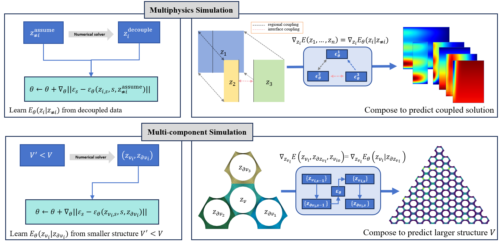

# project_module
This is a project module for a new project, which inludes the file framework, DL pipline, RM.md example and some useful utils.
**To be updating now.**

# paper_name

[Paper](URL) | [arXiv](URL) | [Poster](URL) | [Tweet](URL)

Official repo for the paper [Paper Name](URL).<br />
[Author name]()
ICLR 2025 **under review**.

we propose a compositional generative model for multiphysics and multi-component simulation based on diffusion model (MultiSimDiff). MultiSimDiff utilizes models trained on decoupled data for predicting coupled solutions and model trained on small structures for predicting large structures.

Framework of paper:
<a href="url"></a>

## Installation


1. Install dependencies.

```code
conda create -n ENV_NAME python=3.12.4
```

Install dependencies:
```code
pip install -r requirements.txt
```

Fow the Wasserstein disstance, please see:
https://www.kernel-operations.io/geomloss/

#  file structure
- project_module
  - moose                   # Use to generate datasets for Experiment 2 and Experiment 3, how to use it can be found in: https://mooseframework.org.
  - data                    # data class and dataloader used in the project
  - dataset                 # datasets ready for training or analysis
  - src
    - train                 # codes for training models
    - inference             # codes for inference
    - model                 # model definitions
    - utils                 # Utility scripts and helper functions
    - filepath.py             # Python script for file path handling
  - results                 # results and logs from training and inference
  - .gitignore              # Specifies intentionally untracked files to ignore by git
  - README.md               # Markdown file with information about the project for users
  - reproducibility_statement.md # Markdown file with statements on reproducibility practices
  - requirements.txt        # Text file with a list of dependencies to install


## Dataset and checkpoint

All the dataset can be downloaded in this [this link](URL). Checkpoints are in [this link](URl). Both dataset.zip and checkpoint_path.zip should be decompressed to the root directory of this project.


## Training

Below we provide example commands for training the diffusion model/forward model.
More can be found in "./scripts"

### training model


```code
python reaction_diffusion.py --train_which u --dim 24 --batchsize 256 --paradigm diffusion --epoches 200000
python nuclear_thermal_coupling.py --train_which neutron --dim 8 --batchsize 32 --paradigm diffusion --dataset iter1 --n_dataset 5000 --gradient_accumulate_every 2 --epoches 200000
python heatpipe.py --batchsize 256 --model_type transformer --paradigm surrogate --n_layer 5 --hidden_dim 64 --epoches 100000
```


## inference

The codes for inference are in "./src/inference/"
- reaction_diffusion_2d.ipynb: diffusion model for exp1.
- reaction_diffusion_baseline_2d.ipynb: surrogate model for exp1.
- reaction_diffusion_ablation.ipynb: ablation of diffusion model for exp1.
- reaction_diffusion_couple.ipynb: diffusion model trained by coupled data for exp1.
- nuclear_thermal.ipynb: diffusion model for exp2.
- nuclear_thermal_baseline.ipynb: surrogate model for exp2.
- nuclear_thermal_ablation.ipynb: ablation of diffusion model for exp1.
- nuclear_thermal_couple.ipynb: diffusion model trained by coupled data for exp1.
- heatpipe.ipynb: diffusion model for exp3.
- heatpipe_gnn.ipynb: GIN baseline for exp3.
- heatpipe_transformer.ipynb: Graph transformer baseline for exp3.
- heatpipe_baseline.ipynb: surrogate model for exp3.
- heatpipe_ablation.ipynb: ablation of diffusion model for exp3.
- ws.ipynb: comparision of coupled and decoupled data (medium sturcture and large structure).
## Related Projects

* [NAME](URL) (): brief description of the project.

Numerous practices and standards were adopted from [NAME](URL).
## Citation
If you find our work and/or our code useful, please cite us via:

```bibtex
@inproceedings{
    ...
}
```
